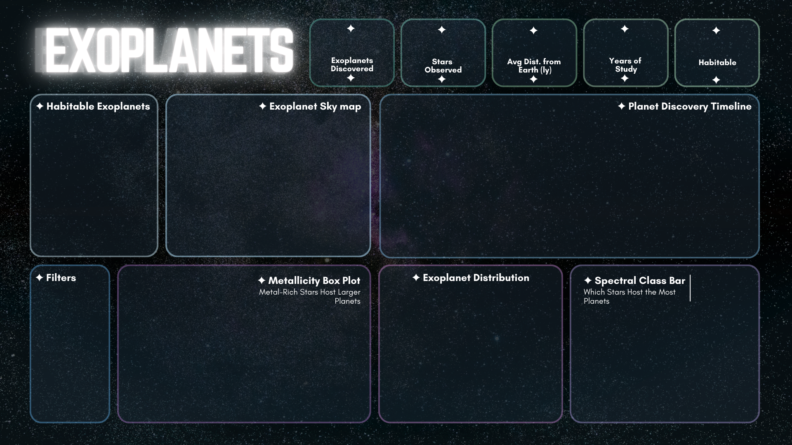

# Exoplanet Data Pipeline & Dashboard



> A full-stack data engineering project analyzing NASA's exoplanet archive — 
> from raw CSV to relational database, interactive Tableau dashboard, 
> and an upcoming Unity physics simulator.

[View Live Interactive Dashboard](https://public.tableau.com/app/profile/asmi.shirke.samant/viz/EXOPLANET_Dashboard/FinalDashboard)

---

## Project Overview

This project builds a complete data pipeline on NASA's confirmed exoplanet 
archive (6,000+ planets), transforming raw observational data into a 
normalized relational database and interactive visualizations via a Tableau Dashboard.

---

## Tech Stack

| Tool | Purpose |
|------|---------|
| Python (Pandas, SQLAlchemy) | Data ingestion and ETL pipeline |
| MySQL | Relational database design and cleaning |
| Tableau Public | Interactive dashboard and visualization |
| Unity (upcoming) | 3D physics simulator |

---

## Project Structure
```
exoplanets/
│
├── data/
│   ├── nasa_raw.csv              # Raw NASA exoplanet archive
│   ├── tableau_stars.csv         # Cleaned stars data
│   ├── tableau_planets.csv       # Cleaned planets data
│   ├── tableau_systems.csv       # Cleaned systems data
│   └── tableau_full.csv          # Joined view for Tableau
│
├── json_exports/
│   ├── unity_stars.json          # Star data for simulator
│   ├── unity_planets.json        # Planet data for simulator
│   └── unity_systems.json        # System coordinates for simulator
│
├── EXOPLANET_DB.sql              # Full database schema and cleaning logic
├── exoplanetcoding.ipynb         # Python ETL notebook
└── README.md
```

---

## Database Design

Three normalized tables with proper relational structure:
```
stars (star_id PK, host_star UNIQUE, spectral_type, temperature, 
       radius, mass, metallicity...)
   ↓
planets (planet_id PK, host_star_id FK → stars, planet_name, 
         radius, mass, orbital_period, equilibrium_temp...)
   ↓
systems (system_id PK, host_star_id FK → stars, distance_pc, 
         ra, dec, planet_count...)
```

**Notable design decisions:**
1) Confidence ratings on every measurement (`'high'`, `'lower estimate'`, 
  `'upper estimate'`, `'unmeasured'`) to filter out non-confirmed records
2) Unified radius and mass columns that fall back from Earth units to 
  Jupiter units when data is missing


---

## Dashboard Features

1) **Animated Sky Map** — All 6,000+ exoplanets plotted by real celestial 
  coordinates, animated by discovery year
2) **Discovery Timeline** — Shows how Kepler's 2009 launch revolutionized 
  exoplanet detection
3) **Metallicity Analysis** — Box plot proving metal-rich stars host 
  larger planets
4) **Planet Type Distribution** — Density and Radius-based classification into Rocky, 
  Super-Earth, Ice/Neptune and Gas Giant
5) **Habitable Planets Table** — Potentially Earth-like worlds out of 6,000+
6) **Spectral Class Analysis** — Which star types host the most planets

---

## Data Source

[NASA Exoplanet Archive](https://exoplanetarchive.ipac.caltech.edu/cgi-bin/TblView/nph-tblView?app=ExoTbls&config=PSCompPars)  
Downloaded: March 2026

---